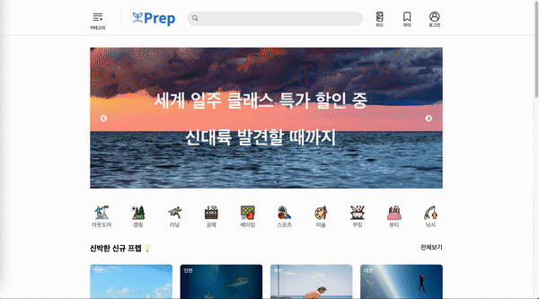

👉 <a href="https://drive.google.com/file/d/1WS_sMDCiSXfQGuiVfNW02JQXhA6RRGI5/view?usp=sharing">데모 영상 전체보기</a><br/>
👉 <a href="http://18.221.140.44:8000/">웹 사이트 방문</a>

## <span style="background-color: #DADFED;">프로젝트 소개</span>

> ### Prep

- WASH 제품 판매 및 구매 서비스 제공
- 스파 트리트먼트 안내 및 예약 서비스 제공
- 구매자들의 별점 및 후기 제공
- 가장 많이 찾는 제품군 검색 기능 제공

> ### 개발 인원 및 기간

- 개발기간 : 2021/11/1 ~ 2021/11/12
- 개발 인원 : 프론트엔드 3명, 백엔드 2명
- github 링크 : https://github.com/RachelParkBlog/Prep-frontend

> ### 프론트엔드 필수구현사항

1. 회원가입, 로그인 기능
2. 제품 카테고리별 리스트 - 카테고리 필터링 기능, 가격순 정렬 기능
3. 제품 상세 페이지 - 카테고리별 페이지 이동 기능, 구매수량 반영 버튼, 탭 메뉴 스크롤 버튼, 리뷰작성 기능

## <span style="background-color: #DADFED;">프로젝트 Wrap-up</span>

### 내가 맡은 기능

#### ✔ Kakao Social Login

- MouseEnter/Leave 이벤트를 이용한 메뉴 dropdown 기능 구현
- '제품'이 아닌 대메뉴에서는 SubMenu를 노출시키지 않도록 구현
- Link를 활용하여 세부 카테고리 메뉴를 클릭시 해당 페이지로 연결 기능 구현
- 상수데이터, map()를 활용한 코드의 간결화 및 가독성을 높이는 작업 진행

#### ✔ List Page

- 적절한 컴포넌트화로 가독성 높임
- 상단 카테고리 필터링 기능을 통해 카테코리 click시 해당 페이지로 이동 기능 구현
- 구매 수량 버튼 클릭시 수량 반영 및 수량에 따른 가격 변동 기능 구현
- Back-end에서 넘겨받은 API 주소를 Path Parameter를 이용하여 특정 상품 클릭시 ProductDetailPage로 이동하도록 기능 구현
- 리뷰 기능 headers에 token을 담아서 인증된 사용자만 리뷰를 작성할 수 있도록 구현
- 리뷰 기능 POST/GET 방식을 활용하여 리뷰를 작성하고 버튼을 클릭 했을 때 작성한 리뷰 노출 기능 구현
- Git의 workflow를 익히고, 협업하는 기술
- Git을 통한 협업 과정에서 발생하는 Conflict 해결 능력

#### ✔ Others

- AWS 프론트 배포 (S3)
  <br/>

## <span style="background-color: #DADFED;">프로젝트를 진행하면서</span>

개인적으로 우리팀은 정말 화목한 팀이라고 자부할 수 있다. 백엔드와의 소통이 정말 잘 됐기 때문이다.
백엔드 팀원분들이 항상 프론트의 의견을 물어보고, 프론트 역시 백엔드에게 계속해서 물어보고, 데이터를 가져오는 형식에 대해 함께 고민하면서 문제를 해결해나가는 과정이 정말 재미있었다.

## <span style="background-color: #DADFED;">프로젝트를 마치며.. </span>

1차 프로젝트를 수행하면서 느낀 점은 확실히 프로젝트라는 하나의 이름으로 다양한 사람들과 협업했을 때 나오는 다양한 생각들과 커뮤니케이션은 내가 생각했던 것보다 컸다.

```toc

```
